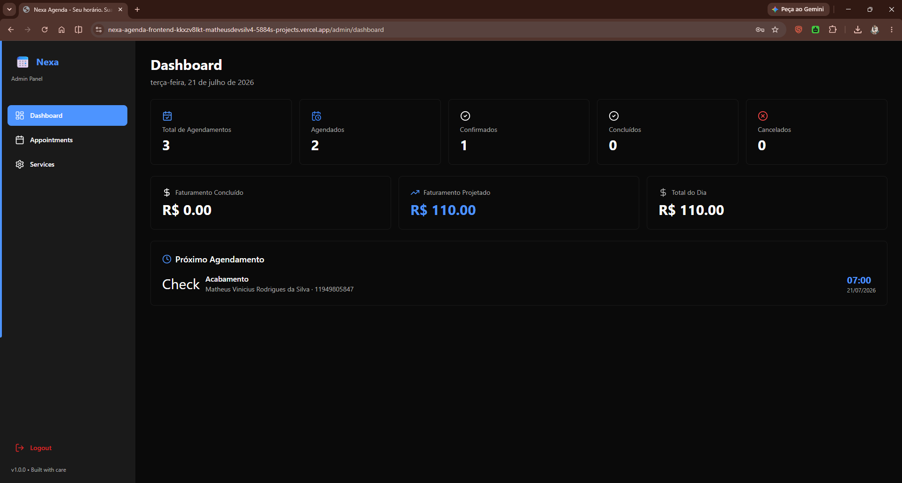

<div align="center">

# 🗓️ Nexa Agenda — Backend

### REST API for Appointment Scheduling and Business Management

API REST responsável pelas regras de negócio, autenticação administrativa, cálculo de disponibilidade, prevenção de conflitos e gerenciamento de serviços e agendamentos da plataforma **Nexa Agenda**.

Desenvolvida com **Node.js**, **Express**, **TypeScript**, **Prisma ORM** e **PostgreSQL**, aplicando arquitetura em camadas, validação com Zod, autenticação JWT, transações e proteções HTTP.

<br>

[](https://nodejs.org/)
[](https://www.typescriptlang.org/)
[](https://expressjs.com/)
[](https://www.prisma.io/)
[](https://www.postgresql.org/)
[](https://jwt.io/)
[](https://railway.app/)

<br>

[**🌐 Frontend**](https://nexa-agenda-frontend.vercel.app)
&nbsp;&nbsp;•&nbsp;&nbsp;
[**⚙️ API**](https://nexa-agenda-backend-production.up.railway.app)
&nbsp;&nbsp;•&nbsp;&nbsp;
[**❤️ Health Check**](https://nexa-agenda-backend-production.up.railway.app/api/health)
&nbsp;&nbsp;•&nbsp;&nbsp;
[**🖥️ Frontend Repository**](https://github.com/MaximillionDev1/nexa-agenda-frontend)

</div>

---

## 📑 Table of Contents

- [About the Project](#-about-the-project)
- [Application Demo](#-application-demo)
- [Engineering Highlights](#-engineering-highlights)
- [Core Features](#-core-features)
- [Business Rules](#-business-rules)
- [Availability Engine](#-availability-engine)
- [Appointment Status](#-appointment-status)
- [System Architecture](#-system-architecture)
- [Project Structure](#-project-structure)
- [Database Model](#-database-model)
- [Technology Stack](#-technology-stack)
- [API Reference](#-api-reference)
- [Authentication](#-authentication)
- [Validation and Error Handling](#-validation-and-error-handling)
- [Security](#-security)
- [Running Locally](#-running-locally)
- [Environment Variables](#-environment-variables)
- [Database Setup](#-database-setup)
- [Available Scripts](#-available-scripts)
- [Deployment](#-deployment)
- [Technical Decisions](#-technical-decisions)
- [Testing Strategy](#-testing-strategy)
- [What This Project Demonstrates](#-what-this-project-demonstrates)
- [Roadmap](#-roadmap)
- [Author](#-author)

---

## 📖 About the Project

O **Nexa Agenda** é uma plataforma Full Stack criada para digitalizar o processo de agendamento e gerenciamento de serviços.

Este repositório contém o backend da aplicação, responsável por concentrar as regras críticas do sistema e fornecer uma API REST para o frontend.

A API realiza:

- disponibilização dos serviços cadastrados;
- cálculo dos horários disponíveis;
- prevenção de conflitos entre atendimentos;
- criação e consulta de agendamentos;
- geração de códigos públicos;
- autenticação de administradores;
- proteção de rotas privadas;
- gerenciamento de serviços;
- gerenciamento do ciclo de vida dos agendamentos;
- cálculo de indicadores operacionais;
- persistência dos dados em PostgreSQL.

A lógica de negócio permanece centralizada no backend para evitar que alterações realizadas no cliente comprometam a integridade dos dados.

### Problem

Em negócios que trabalham com horários marcados, o controle manual pode causar:

- reservas duplicadas;
- serviços agendados fora do expediente;
- dificuldade para localizar atendimentos;
- baixa visibilidade sobre a disponibilidade;
- inconsistência na alteração de status;
- dependência de validações feitas apenas pela interface.

### Solution

```text
Cliente ou administrador
          │
          ▼
       REST API
          │
          ▼
Validações e regras de negócio
          │
          ▼
      Prisma ORM
          │
          ▼
      PostgreSQL
```

---

## 🎬 Application Demo

### Production

| Resource | URL |
|---|---|
| Frontend | https://nexa-agenda-frontend.vercel.app |
| Backend API | https://nexa-agenda-backend-production.up.railway.app |
| Health Check | https://nexa-agenda-backend-production.up.railway.app/api/health |
| Frontend Repository | https://github.com/MaximillionDev1/nexa-agenda-frontend |

### Demo Credentials

> [!IMPORTANT]
> A conta abaixo é pública e destinada exclusivamente à demonstração e avaliação técnica. Não reutilize estas credenciais em outros ambientes.

| Field | Value |
|---|---|
| E-mail | `admin@nexaagenda.com` |
| Password | `Admin@123` |

### Full Flow

<p align="center">
  
</p>

### Administrative Dashboard

<p align="center">
  
</p>

### Appointment Management

<p align="center">
  
</p>

> A documentação visual completa da interface está disponível no repositório do frontend.

---

## 🏆 Engineering Highlights

- API REST desenvolvida com Node.js, Express e TypeScript.
- Arquitetura organizada em camadas.
- PostgreSQL integrado por meio do Prisma ORM.
- Autenticação administrativa com JWT.
- Senhas protegidas com bcrypt.
- Entradas validadas com Zod.
- Disponibilidade calculada conforme horário de funcionamento e duração do serviço.
- Prevenção de conflitos por sobreposição de intervalos.
- Nova verificação de disponibilidade dentro da transação de criação.
- Consulta pública protegida por código e telefone.
- Rotas administrativas protegidas por middleware.
- Tratamento centralizado de erros.
- Proteções com Helmet, CORS e rate limiting.
- Migrations e seed para preparação dos ambientes.
- Deploy da API e do PostgreSQL no Railway.

---

## ⚙️ Core Features

### Services

- Listagem pública dos serviços ativos.
- Consulta de serviço por identificador.
- Cadastro administrativo de novos serviços.
- Atualização de serviços existentes.
- Ativação e desativação.
- Exclusão de serviços.

### Availability

- Consulta de horários disponíveis por data e serviço.
- Cálculo baseado na duração de cada serviço.
- Respeito ao horário de funcionamento de cada dia.
- Geração de slots em intervalos de 30 minutos.
- Exclusão dos períodos já ocupados.
- Desconsideração dos agendamentos cancelados.
- Consulta do próximo horário disponível.

### Appointments

- Criação pública de agendamentos.
- Geração de código público de identificação.
- Consulta por código público e telefone.
- Listagem administrativa.
- Consulta individual por ID.
- Filtros por data, status, serviço e cliente.
- Atualização de status.
- Cancelamento.
- Exclusão.
- Estatísticas dos atendimentos do dia.
- Consulta da receita prevista do dia.

### Administration

- Login administrativo.
- Emissão de token JWT.
- Validação da sessão.
- Consulta do administrador autenticado.
- Dashboard com indicadores operacionais.
- Proteção das rotas privadas.

---

## 🧠 Business Rules

As regras críticas foram implementadas no backend para preservar a consistência do sistema independentemente do cliente que consome a API.

### Date and Time Validation

A API não permite:

- agendamentos em datas passadas;
- horários anteriores ao momento atual;
- reservas fora do horário de funcionamento;
- utilização de serviços inexistentes;
- utilização de serviços inativos;
- reservas que ultrapassem o fechamento;
- reservas conflitantes com atendimentos existentes.

### Public Lookup

Para consultar um agendamento sem autenticação administrativa, o cliente deve informar:

- código público;
- telefone usado no cadastro.

O telefone é normalizado antes da comparação, evitando divergências provocadas por máscaras ou caracteres de formatação.

### Transactional Creation

A criação do agendamento utiliza uma transação no banco de dados. Dentro dessa operação, a disponibilidade é verificada novamente antes da persistência.

```text
Solicitação recebida
          │
          ▼
Validar entrada
          │
          ▼
Validar serviço
          │
          ▼
Validar data e horário
          │
          ▼
Calcular horário final
          │
          ▼
Validar expediente
          │
          ▼
Abrir transação
          │
          ▼
Verificar conflito novamente
          │
          ▼
Criar agendamento
          │
          ▼
Confirmar transação
```

---

## ⏰ Availability Engine

A disponibilidade é calculada dinamicamente considerando:

1. dia solicitado;
2. horário de abertura;
3. horário de fechamento;
4. duração do serviço;
5. slots de 30 minutos;
6. agendamentos já cadastrados;
7. status dos agendamentos existentes;
8. horário atual, quando a consulta ocorre para o mesmo dia.

### Default Business Hours

| Day | Business Hours |
|---|---|
| Monday | 09:00–18:00 |
| Tuesday | 09:00–18:00 |
| Wednesday | 09:00–18:00 |
| Thursday | 09:00–18:00 |
| Friday | 09:00–18:00 |
| Saturday | 09:00–16:00 |
| Sunday | Closed |

### Conflict Detection

Existe conflito quando:

```text
newStart < existingEnd
AND
newEnd > existingStart
```

```text
Existing appointment: 10:00 ───────── 11:00
New appointment:             10:30 ───────── 11:30
                               ▲
                            Conflict
```

Agendamentos com status `CANCELED` não bloqueiam novos horários.

---

## 📌 Appointment Status

| Status | Description |
|---|---|
| `SCHEDULED` | Atendimento agendado |
| `CONFIRMED` | Atendimento confirmado |
| `COMPLETED` | Atendimento concluído |
| `CANCELED` | Atendimento cancelado |

---

## 🏗️ System Architecture

```text
HTTP Request
      │
      ▼
    Routes
      │
      ▼
  Middlewares
      │
      ▼
 Controllers
      │
      ▼
   Services
      │
      ▼
 Repositories
      │
      ▼
  Prisma ORM
      │
      ▼
 PostgreSQL
```

### Routes

Definem endpoints, métodos HTTP, middlewares e encaminhamento aos controllers.

### Middlewares

Aplicam autenticação JWT, proteção de rotas, segurança e tratamento compartilhado.

### Controllers

Recebem parâmetros, query strings e body, acionam os services e constroem a resposta HTTP.

### Services

Concentram autenticação, disponibilidade, conflitos, criação de agendamentos, indicadores e gerenciamento de serviços.

### Repositories

Isolam as operações de persistência realizadas com Prisma.

### Schemas

Utilizam Zod para validar body, parâmetros, filtros, credenciais e dados de criação ou atualização.

---

## 📂 Project Structure

```text
nexa-agenda-backend/
├── docs/
│   └── images/
│       ├── admin-appointments.png
│       ├── admin-dashboard.png
│       └── demo.gif
├── prisma/
│   ├── migrations/
│   ├── schema.prisma
│   └── seed.ts
├── src/
│   ├── config/
│   ├── controllers/
│   ├── errors/
│   ├── middlewares/
│   ├── repositories/
│   ├── routes/
│   ├── schemas/
│   ├── services/
│   ├── types/
│   ├── utils/
│   ├── app.ts
│   └── server.ts
├── .env.example
├── package.json
├── test.http
├── tsconfig.json
└── README.md
```

---

## 🗄️ Database Model

```text
Admin

Service 1 ───────────── N Appointment

BusinessHours
    └── defines weekly availability
```

### Admin

Representa os usuários autorizados a acessar o painel administrativo.

### Service

Armazena nome, descrição, duração, preço e situação ativa ou inativa.

### Appointment

Relaciona cliente, telefone, serviço, data, horário inicial, horário final, status e código público.

### BusinessHours

Armazena o horário de funcionamento de cada dia da semana.

### Migrations and Seed

As migrations versionam alterações estruturais. O seed prepara administrador de demonstração, horários de funcionamento e dados iniciais.

---

## 🛠️ Technology Stack

| Technology | Responsibility |
|---|---|
| Node.js | Ambiente de execução |
| Express | Construção da API REST |
| TypeScript | Tipagem estática |
| PostgreSQL | Persistência relacional |
| Prisma ORM | Modelagem, migrations e acesso tipado |
| date-fns | Manipulação de datas |
| Zod | Validação de entradas |
| JWT | Autenticação administrativa |
| bcrypt | Hash de senhas |
| Helmet | Cabeçalhos HTTP de segurança |
| CORS | Controle de origens |
| Express Rate Limit | Limitação de requisições |
| Vitest | Base para testes automatizados |
| Supertest | Base para testes HTTP |

---

## 🌐 API Reference

### Base URL

```text
https://nexa-agenda-backend-production.up.railway.app/api
```

### Access Legend

| Access | Description |
|---|---|
| Public | Não requer autenticação |
| Protected | Requer `Authorization: Bearer <token>` |

### Endpoint Summary

| Method | Endpoint | Access | Description |
|---|---|---|---|
| `GET` | `/api/health` | Public | Verifica a API |
| `POST` | `/api/auth/login` | Public | Autentica o administrador |
| `GET` | `/api/auth/me` | Protected | Retorna o administrador autenticado |
| `GET` | `/api/services` | Public | Lista serviços ativos |
| `GET` | `/api/services/:id` | Public | Consulta um serviço |
| `POST` | `/api/services` | Protected | Cria um serviço |
| `PATCH` | `/api/services/:id` | Protected | Atualiza um serviço |
| `PATCH` | `/api/services/:id/toggle` | Protected | Ativa ou desativa um serviço |
| `DELETE` | `/api/services/:id` | Protected | Exclui um serviço |
| `GET` | `/api/availability` | Public | Consulta horários disponíveis |
| `GET` | `/api/next-available-slot` | Public | Consulta o próximo horário |
| `POST` | `/api/appointments` | Public | Cria um agendamento |
| `POST` | `/api/appointments/lookup` | Public | Consulta por código e telefone |
| `GET` | `/api/appointments` | Protected | Lista agendamentos |
| `GET` | `/api/appointments/:id` | Protected | Consulta um agendamento |
| `PATCH` | `/api/appointments/:id/status` | Protected | Atualiza o status |
| `PATCH` | `/api/appointments/:id/cancel` | Protected | Cancela um agendamento |
| `DELETE` | `/api/appointments/:id` | Protected | Exclui um agendamento |
| `GET` | `/api/appointments/stats/today` | Protected | Estatísticas do dia |
| `GET` | `/api/appointments/revenue/today` | Protected | Receita prevista do dia |
| `GET` | `/api/admin/dashboard` | Protected | Indicadores do dashboard |

### Health Check

```http
GET /api/health
```

```json
{
  "status": "ok"
}
```

### Login

```http
POST /api/auth/login
Content-Type: application/json
```

```json
{
  "email": "admin@nexaagenda.com",
  "password": "Admin@123"
}
```

### Create Appointment

```http
POST /api/appointments
Content-Type: application/json
```

```json
{
  "serviceId": "service-id",
  "customerName": "Nome do cliente",
  "customerPhone": "(11) 99999-9999",
  "date": "2026-07-30",
  "startTime": "10:00"
}
```

> Os nomes e formatos definitivos dos campos devem seguir os schemas do código-fonte.

### Lookup Appointment

```http
POST /api/appointments/lookup
Content-Type: application/json
```

```json
{
  "publicCode": "PUBLIC_CODE",
  "phone": "(11) 99999-9999"
}
```

---

## 🔐 Authentication

```text
Administrator submits credentials
              │
              ▼
API locates administrator
              │
              ▼
bcrypt compares password
              │
              ▼
API generates JWT
              │
              ▼
Client sends Bearer token
              │
              ▼
Middleware validates token
              │
              ▼
Protected operation is authorized
```

```http
Authorization: Bearer YOUR_TOKEN
```

---

## ✅ Validation and Error Handling

Os schemas Zod validam body, parâmetros, query strings, credenciais, filtros e identificadores.

O middleware central de erros oferece:

- respostas HTTP consistentes;
- menor repetição nos controllers;
- separação entre falha operacional e resposta;
- manutenção simplificada.

A API pode rejeitar solicitações por:

- dados inválidos;
- credenciais incorretas;
- token ausente ou inválido;
- recurso não encontrado;
- serviço inativo;
- data ou horário inválido;
- conflito de agendamento;
- operação não autorizada.

---

## 🛡️ Security

| Resource | Role |
|---|---|
| bcrypt | Proteção das senhas armazenadas |
| JWT | Identificação da sessão administrativa |
| Auth middleware | Proteção das rotas privadas |
| Zod | Rejeição de entradas inválidas |
| Helmet | Cabeçalhos HTTP de segurança |
| CORS | Restrição das origens autorizadas |
| Rate limit | Redução de abuso e excesso de requisições |
| Environment variables | Segredos fora do código-fonte |

> [!WARNING]
> Nunca envie arquivos `.env`, senhas reais, tokens ou credenciais de produção para o repositório.

---

## 🚀 Running Locally

### Prerequisites

- Node.js 20 ou superior;
- npm;
- Git;
- PostgreSQL.

### Clone and Install

```bash
git clone https://github.com/MaximillionDev1/nexa-agenda-backend.git
cd nexa-agenda-backend
npm install
```

### Configure Environment

```bash
cp .env.example .env
```

Windows PowerShell:

```powershell
Copy-Item .env.example .env
```

### Prepare Database

```bash
npm run prisma:generate
npm run prisma:migrate
npm run prisma:seed
```

### Start

```bash
npm run dev
```

```text
http://localhost:3333
http://localhost:3333/api/health
```

---

## 🔑 Environment Variables

```env
DATABASE_URL=
NODE_ENV=development
PORT=3333
JWT_SECRET=
JWT_EXPIRES_IN=7d
FRONTEND_URL=http://localhost:5173
```

| Variable | Description |
|---|---|
| `DATABASE_URL` | Conexão com PostgreSQL |
| `NODE_ENV` | Ambiente de execução |
| `PORT` | Porta HTTP |
| `JWT_SECRET` | Segredo de assinatura dos tokens |
| `JWT_EXPIRES_IN` | Validade do token |
| `FRONTEND_URL` | Origem autorizada no CORS |

---

## 🗃️ Database Setup

```bash
npm run prisma:migrate
npm run prisma:migrate:deploy
npm run prisma:generate
npm run prisma:seed
npm run prisma:studio
```

---

## 📜 Available Scripts

| Script | Description |
|---|---|
| `npm run dev` | Desenvolvimento com watch |
| `npm run build` | Gera Prisma Client e compila TypeScript |
| `npm start` | Executa o código compilado |
| `npm run start:prod` | Aplica migrations e inicia produção |
| `npm run prisma:generate` | Gera Prisma Client |
| `npm run prisma:migrate` | Migrations de desenvolvimento |
| `npm run prisma:migrate:deploy` | Aplica migrations em produção |
| `npm run prisma:seed` | Executa o seed |
| `npm run prisma:studio` | Abre Prisma Studio |
| `npm run lint` | Executa lint |
| `npm test` | Executa Vitest |

---

## ☁️ Deployment

| Layer | Platform |
|---|---|
| Frontend | Vercel |
| Backend | Railway |
| Database | PostgreSQL on Railway |

```text
GitHub Repository
        │
        ▼
Railway Build
        │
        ├── prisma generate
        ├── TypeScript compilation
        └── production start
                │
                ▼
        prisma migrate deploy
                │
                ▼
          Express API
                │
                ▼
           PostgreSQL
```

Build:

```bash
npm run build
```

Start:

```bash
npm run start:prod
```

---

## 🎯 Technical Decisions

### Layered Architecture

Routes, controllers, services e repositories possuem responsabilidades distintas.

### Business Rules on the Backend

As validações críticas não dependem da interface.

### Prisma ORM

Oferece acesso tipado, schema declarativo, migrations, transações e integração com TypeScript.

### PostgreSQL

Fornece consistência relacional, integridade e suporte a transações.

### JWT Authentication

Mantém a API stateless e protege as operações administrativas.

### Transactional Booking

A disponibilidade é revalidada antes da persistência para reduzir inconsistências.

### Public Code + Phone

Permite consulta sem conta, exigindo dois dados relacionados ao agendamento.

---

## 🧪 Testing Strategy

O projeto possui **Vitest** e **Supertest** instalados como base para testes automatizados.

### Recommended Unit Tests

- normalização de telefone;
- geração de horários;
- detecção de sobreposição;
- validação de datas;
- cálculo do horário final.

### Recommended Integration Tests

- health check;
- autenticação;
- criação de serviço;
- criação de agendamento;
- conflito entre horários;
- consulta pública;
- proteção de rotas;
- alteração de status.

> As ferramentas estão presentes no projeto, mas esta documentação não apresenta uma cobertura automatizada completa como já implementada.

---

## 💡 What This Project Demonstrates

- Node.js;
- Express;
- TypeScript;
- APIs REST;
- arquitetura em camadas;
- PostgreSQL;
- Prisma ORM;
- modelagem de dados;
- migrations e seed;
- autenticação JWT;
- hash de senhas;
- validação com Zod;
- regras de negócio;
- transações;
- prevenção de conflitos;
- tratamento centralizado de erros;
- segurança HTTP;
- deploy em produção;
- integração Frontend–Backend;
- Git e GitHub.

---

## 🛣️ Roadmap

- [ ] Ampliar testes unitários.
- [ ] Criar testes de integração.
- [ ] Adicionar relatório de cobertura.
- [ ] Publicar documentação OpenAPI/Swagger.
- [ ] Adicionar Docker e Docker Compose.
- [ ] Criar pipeline de CI.
- [ ] Implementar logs estruturados.
- [ ] Adicionar monitoramento.
- [ ] Implementar recuperação de senha.
- [ ] Adicionar notificações por e-mail.
- [ ] Integrar lembretes.
- [ ] Suportar múltiplas empresas.
- [ ] Permitir configuração administrativa dos horários.

---

## 👨‍💻 Author

### Matheus Vinicius Rodrigues da Silva

Desenvolvedor Full Stack

- GitHub: [@MaximillionDev1](https://github.com/MaximillionDev1)
- LinkedIn: [matheus-vinicius-dev](https://linkedin.com/in/matheus-vinicius-dev)
- E-mail: [matheusdevsilv4@gmail.com](mailto:matheusdevsilv4@gmail.com)
- Telefone: +55 (11) 94980-5847

---

<div align="center">

Developed with dedication as part of a Full Stack technical challenge.

⭐ Se este projeto foi útil ou interessante, considere deixar uma estrela no repositório.

</div>
